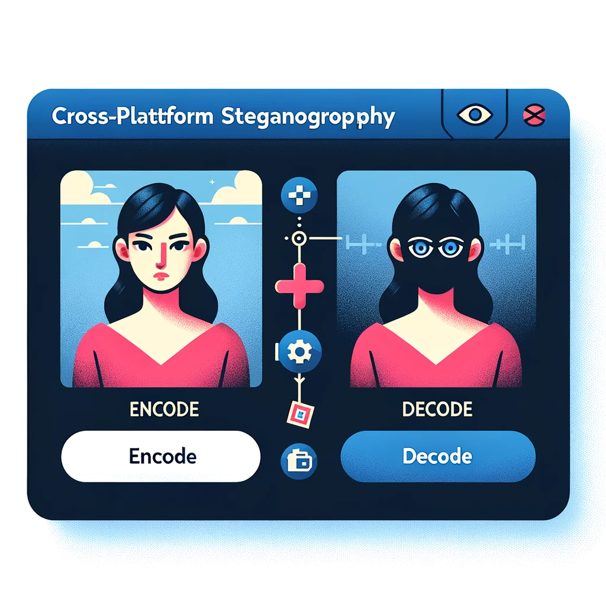
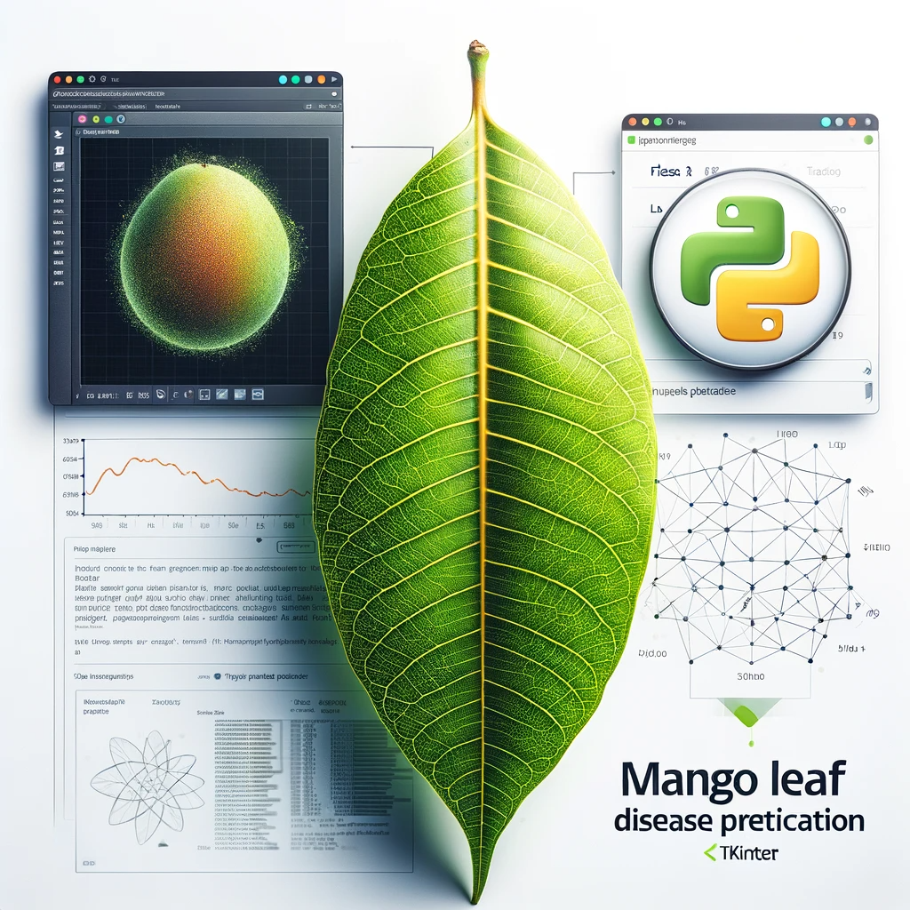
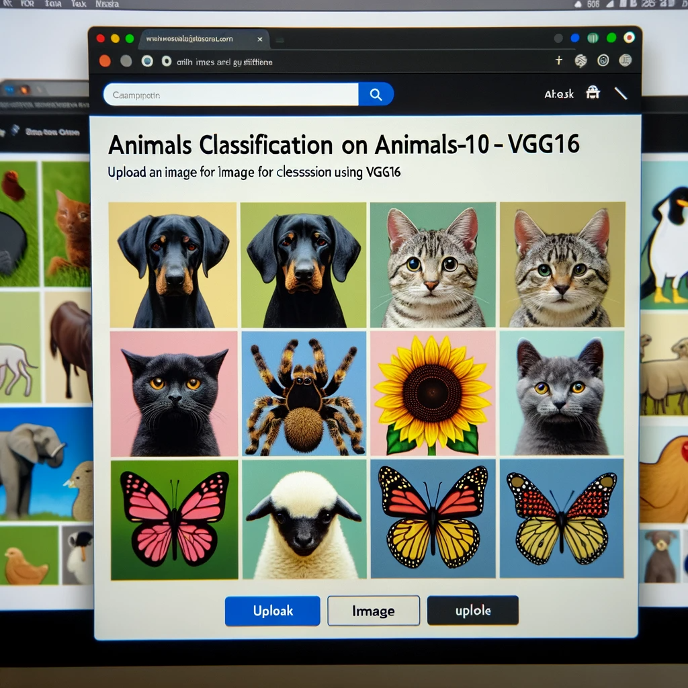
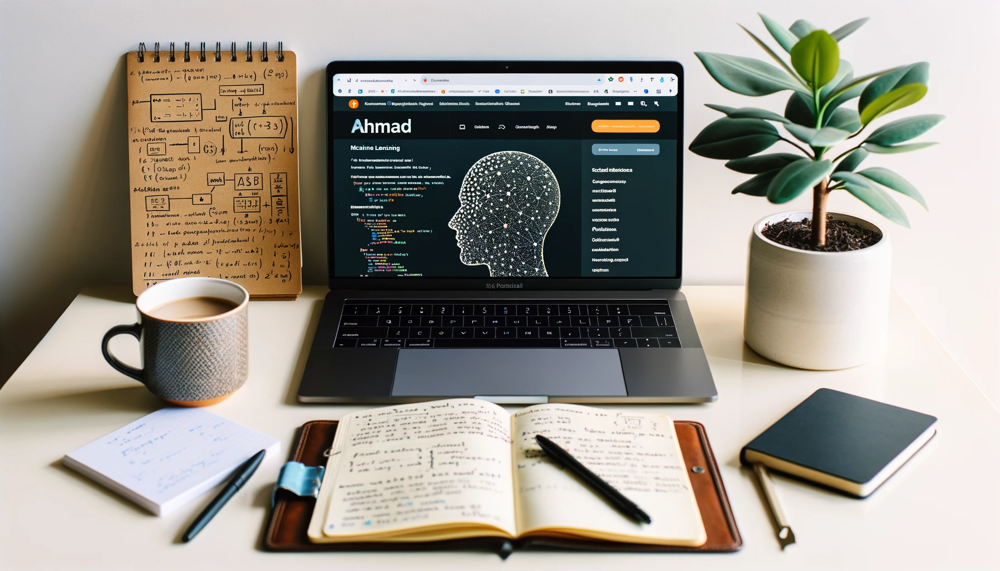

Image generated by DALL·E 3

# 👨‍💼 Chethan H N's Portfolio

🌟 Welcome to my portfolio page where I showcase my machine learning and data science projects, along with my certifications. 🌟

## 🌍 Overview

  
  
Image generated by DALL·E 3

- 🏢 **Position**: Artificial Intelligence Developer
- 🏦 **Company**: VIT(DRDO Funded Project),Chennai, India
- 🌏 **Location**: Chennai, India

## 🚀 Skills

- 🖥️ Programming Languages: Python, SQL.
- 🖥️ Database : SQL (MySQL), Vector Database(VectordDB)
- 🤖 Frameworks: Pytorch, Tensorflow, Keras,Langchain
- 🤖Libraries: Pandas, NumPy, Matplotlib, Seaborn, scikit-learn, SciPy, OpenCV, Hugging Face Transformers, Genism, and NLTK,Spacy.
- 🤖 Machine Learning Techniques: Regression, Classification, Clustering, Decision Tree, Dimensionality Reduction, Ensemble Methods (Random Forest, XGBoost).
- 🧠 Deep Learning: CNN, RNN, LSTM, TensorFlow, PyTorch, Transfer Learning, OpenCV, NLTK, Natural Language Processing, Computer Vision,Large Language Models(LLM)
- 🔍 Data Science & Miscellaneous Technologies: Data science pipeline (cleansing, wrangling, visualization, modeling, interpretation), Statistics, Probability, Time Series, Git, Streamlit.
- 📊 Data Analysis Tools: Microsoft Excel, Tableau.
- ☁️ Cloud Technologies:AWS Sagemaker,Google Cloud.
- 🚀 Deployment Tools: Docker 🐳 , Streamlit
- 🤖 Other Skills: MLflow,Weights & Bias,Linux,Git,GitHub ,Tableau, Linux ,Advanced Excel.

## 👔 Professional Experience
### Artificial Intelligence Developer 
#### VIT, Chennai  (March 2023 - Present)
####  Client : [Centre for Artificial Intelligence & Robotics (CAIR),DRDO, Bangalore](https://www.drdo.gov.in/labs-and-establishments/centre-artificial-intelligence-robotics-cair#nolink) 

  
  
Credit: DRDO

- Implementation of ML & DL techniques: Apply Machine Learning and Deep learning methods for real-time log data analysis.
- Collect and preprocess data: Use Wazuh SIEM and Python with regex for log data collection, preprocessing, labeling, and transformation of log data.
- Build and evaluate models: Utilize PyTorch, TensorFlow, and Transformers to create ML, DL, and AI models. Train and optimize models with labeled log data.
- Deploy and integrate solutions: Collaborate with teams to integrate ML based log analysis into existing cybersecurity infrastructure. Use Docker for efficient deployment and system integration.

### Research Fellow Intern
#### [Madras Scientific Research Foundation(MSRF)](https://www.madrasresearch.org/) , Chennai  (Dec 2022 - March 2023)
- Worked on a research project focused on image recognition using CNN for defect detection in fused deposition modelling.
- Involved in the development and implementation of a CNN model to identify defects in 3D printed parts. 
- Participating in the training and evaluation of the model using a dataset of images with various defects

### Machine Learning Intern	   (Sep 2022 – Nov 2022)
#### [Feynn Labs](https://feynnlabs.com/) , Bangalore  (Sep 2022 - Nov 2022)
- Participated in a team project focused on the development of an AI product/service prototype. 
- Assisted in the selection of a prototype idea based on feasibility, viability, and monetization criteria.
- Developed a business model for the AI product/service, including market analysis, target audience, pricing strategy, and revenue streams. 

## 📜 Courses and Certifications
- [Data Scientist Master Program Cerfication](https://success.simplilearn.com/6d7e42a7-5842-4ca7-9eba-73cbabffc53f#gs.1e3bu0) by Simplilearn
- [Python ](https://certificates.simplicdn.net/share/thumb_3687568_1660274412.png) by Simplilearn
- [Deep Neural Networks with Pytorch](https://www.coursera.org/account/accomplishments/verify/4APRJRZ3B93T) by Coursera
- [Deep Learning with Keras and Tensorflow](https://certificates.simplicdn.net/share/4614209_1698670643.pdf) by Simplilearn
- [Machine Learning with Python](https://freecodecamp.org/certification/chethanhn/machine-learning-with-python-v7) by freeCodeCamp
- [Generative AI with Large Language Models](https://coursera.org/share/4b21792f6551d0c5096f1d761417278f)by Coursera
- [LangChain Chat with Your Data](https://coursera.org/share/4b21792f6551d0c5096f1d761417278f) by Deeplearning.ai
- [Business Analytics with Excel](https://certificates.simplicdn.net/share/3887343.pdf) by Simplilearn
- [SQL](https://certificates.simplicdn.net/share/3888982.pdf) by Simplilearn
- [Statistics](https://certificates.simplicdn.net/share/3874022.pdf) by Simplilearn
- [Data Science with Python](https://certificates.simplicdn.net/share/3702953.pdf) by Simplilearn
- [Machine Learning Advanced Certification](https://certificates.simplicdn.net/share/3709679.pdf) by Simplilearn
- [Tableau](https://certificates.simplicdn.net/share/3742922.pdf) by Simplilearn
- [Multilayer Perceptron](https://olympus.mygreatlearning.com/courses/64308/certificate) by Great Learning

## 🎨 Projects

- [Image Steganography Tool](https://github.com/pypi-ahmad/Image-Steganography-Tool)
  

    
    
Image generated by DALL·E 3

  

- [Super Market Sales Prediction](https://github.com/pypi-ahmad/Super-Market-Sales-Prediction)
  

    
    
Image generated by DALL·E 3

  

- [Mango Leaf Disease Prediction](https://github.com/pypi-ahmad/Mango-Leaf-Disease-Prediction)
  

    
    
Image generated by DALL·E 3

  

- [Animals Classification on Animals-10 Dataset using VGG16](https://github.com/pypi-ahmad/Animals-Classification-on-Animals-10-Dataset-using-VGG16)
  

    
    
Image generated by DALL·E 3

  

- ...and [more](https://github.com/pypi-ahmad?tab=repositories)

## 📚 Resources

- [Cheatsheets](https://github.com/pypi-ahmad/Cheatsheets)
- [Classification Templates](https://github.com/pypi-ahmad/Classification-Templates)
- [Regression Templates](https://github.com/pypi-ahmad/Regression-Templates)
- [Data Preprocessing Tools and Templates](https://github.com/pypi-ahmad/Data-Preprocessing-Tools-and-Templates)
- [Face Recognition Flask App](https://github.com/pypi-ahmad/FaceRecognition_Flask)
- [Machine Learning Model Selection](https://github.com/pypi-ahmad/Machine-Learning-Model-Selection)

## 📄 Resume

Interested in diving deeper into my professional journey? Check out my detailed resume [here](https://github.com/pypi-ahmad/My-Resume).

## 💌 Contact

- 📡 Telegram Channel: [MLDS Insights](https://t.me/MLDSInsights)
- 📱 Telegram Account: [Peaceful Data Mind](https://t.me/peacefuldatamind)
- 🌐 LinkedIn: [Profile](https://www.linkedin.com/in/ahmad-iiitk/)
- 📺 YouTube: [Channel](https://www.youtube.com/channel/UC38wvN6ZalnJAKjel48i18w)
- 📸 Instagram: [Peaceful Data Mind](https://www.instagram.com/peacefuldatamind/)
- 📊 Kaggle: [pypiahmad](https://www.kaggle.com/pypiahmad)

  
  
Image generated by DALL·E 3

